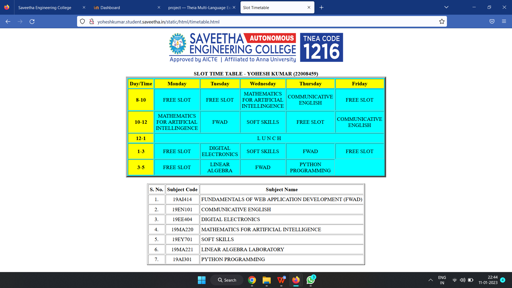
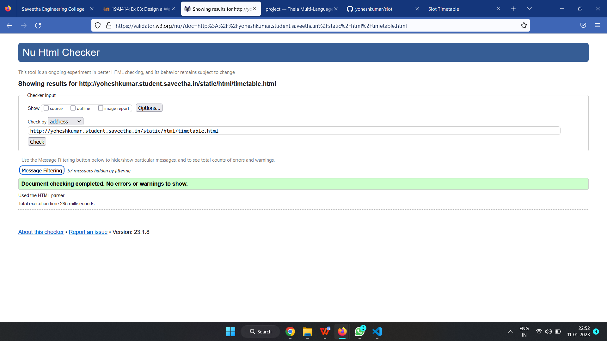

# Experiment_Time_Table

## AIM
To Write a html webpage page to display your timetable.

# ALGORITHM
### STEP 1
create a simple table using table tag
### STEP 2
Add header row using th tag
### STEP 3
Add your timetable
### STEP 4
Execute the program

# CODE:
```
<!DOCTYPE html>
<html lang="en">
<head>
<title>Slot Timetable</title>
</head>
<body>
<center>

</center>
<br>
<table align="center" width="540" cellspacing="2" cellpadding="4" border="5" bgcolor="cyan">
<caption><b>SLOT TIME TABLE - YOHESH KUMAR (22008459)</b></caption>
<tr align="center">
<th bgcolor="yellow">Day/Time</th>
<th bgcolor="yellow">Monday</th>
<th bgcolor="yellow">Tuesday</th>
<th bgcolor="yellow">Wednesday</th>
<th bgcolor="yellow">Thursday</th>
<th bgcolor="yellow">Friday</th>
</tr>
<tr align="center">
<th bgcolor="yellow">8-10</th>
<td >FREE SLOT</td>
<td>FREE SLOT</td>
<td>MATHEMATICS FOR ARTIFICIAL INTELLINGENCE</td>
<td>COMMUNICATIVE ENGLISH</td>
<td>FREE SLOT</td>
</tr>
<tr align="center">
<th bgcolor="yellow">10-12</th>
<td>MATHEMATICS FOR ARTIFICIAL INTELLINGENCE</td>
<td> FWAD</td>
<td>SOFT SKILLS</td>
<td>FREE SLOT</td>
<td>COMMUNICATIVE ENGLISH</td>
</tr>
<tr>
<th bgcolor="yellow">12-1</th>
<td colspan="5" align="center">L U N C H</td>
</tr>
<tr align="center">
<th bgcolor="yellow">1-3</th>
<td > FREE SLOT </td>
<td>DIGITAL ELECTRONICS</td>
<td>SOFT SKILLS</td>
<td>FWAD</td>
<td>FREE SLOT </td>
</tr>
<tr align="center">
<th bgcolor="yellow">3-5</th>
<td > FREE SLOT </td>
<td>LINEAR ALGEBRA</td>
<td>FWAD</td>
<td>PYTHON PROGRAMMING</td>
</tr>
</table>
<br>
<table align="center" cellspacing="2" cellpadding="4" border="2">
<tr align="center">
<th>S. No.</th>
<th>Subject Code</th>
<th>Subject Name</th>
</tr>
<tr>
<td align="center">1.</td>
<td align="center">19AI414</td>
<td>FUNDAMENTALS OF WEB APPLICATION DEVELOPMENT (FWAD)</td>
</tr>
<tr>
<td align="center">2.</td>
<td align="center">19EN101</td>
<td>COMMUNICATIVE ENGLISH</td>
</tr>
<tr>
<td align="center">3.</td>
<td align="center">19EE404</td>
<td>DIGITAL ELECTRONICS</td>
</tr>
<tr>
<td align="center">4.</td>
<td align="center">19MA220</td>
<td>MATHEMATICS FOR ARTIFICIAL INTELLIGENCE</td>
</tr>
<tr>
<td align="center">5.</td>
<td align="center">19EY701</td>
<td>SOFT SKILLS</td>
</tr>
<tr>
<td align="center">6.</td>
<td align="center">19MA221</td>
<td>LINEAR ALGEBRA LABORATORY</td>
</tr>
<tr>
<td align="center">7.</td>
<td align="center">19AI301</td>
<td>PYTHON PROGRAMMING</td>
</tr>


</table>
</body>
</html>
```

# OUPUT:


# HTML VALIDATOR:


# RESULT:
The program for creating slot timetable is completed successfully.